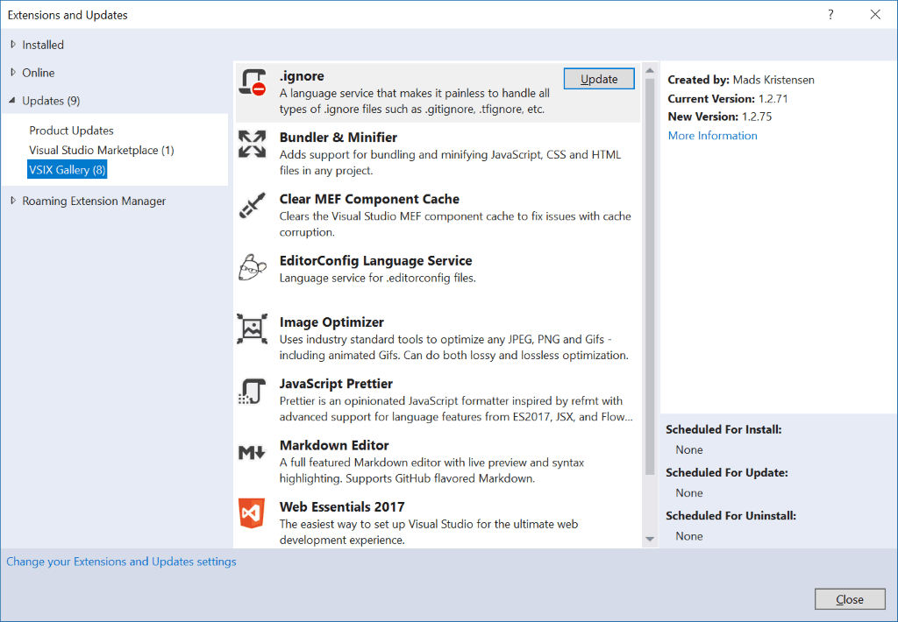

# VSIX Gallery - nightly builds

<!-- Replace this badge with your own-->

<!-- Update the VS Gallery link after you upload the VSIX-->
Download this extension from the [VS Gallery](https://visualstudiogallery.msdn.microsoft.com/[GuidFromGallery])
or get the [CI build](http://vsixgallery.com/extension/32b51a45-f958-4a80-8575-2c9906e45057/).

---------------------------------------

Get on the cutting edge by using the nighly builds of your favorite extensions from vsixgallery.com

See the [change log](CHANGELOG.md) for changes and road map.

## VsixGallery.com
This website is used be many extension developers to share their nightly or CI builds with their users. After installing this extension you can see all the extensions from [vsixgallery.com](http://vsixgallery.com) directly in the *Online* and *Updates* tabs in the Extensions and Updates dialog.
  

This makes it very easy to grab the latest builds of your favorite extensions.

## Auto updating
By default, Visual Studio 2015 and newer will automatically update any extension when a new one becomes available on either the Marketplace or any custom feed like the one added by this extension. 

This will ensure that you are always on the latest builds of any of the supported extensions.

## Contribute
Check out the [contribution guidelines](.github/CONTRIBUTING.md)
if you want to contribute to this project.

For cloning and building this project yourself, make sure
to install the
[Extensibility Tools 2015](https://visualstudiogallery.msdn.microsoft.com/ab39a092-1343-46e2-b0f1-6a3f91155aa6)
extension for Visual Studio which enables some features
used by this project.

## License
[Apache 2.0](LICENSE)